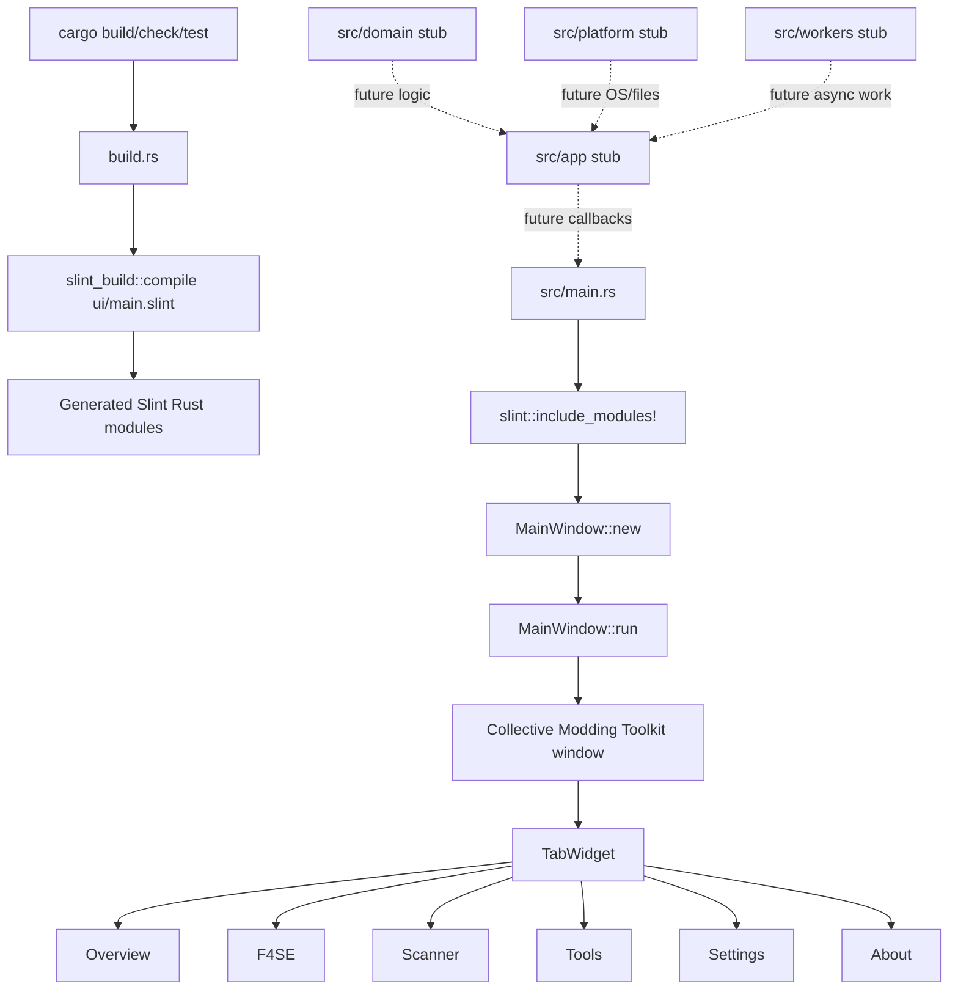

# Phase 01: Slint Shell & Port Architecture - Research

**Researched:** 2026-05-16  
**Domain:** Rust/Slint desktop shell foundation and port architecture boundaries  
**Confidence:** HIGH

<user_constraints>
## User Constraints (from CONTEXT.md)

### Locked Decisions
- **D-01:** Use `ui/main.slint` plus one component file per tab for Phase 1 rather than putting every placeholder directly in `main.slint`. [VERIFIED: `.planning/phases/01-slint-shell-port-architecture/01-CONTEXT.md`]
- **D-02:** Tab component files should contain inert placeholder content only. The placeholder text should be short scope notes that make clear each tab's real behavior belongs to later phases. [VERIFIED: `.planning/phases/01-slint-shell-port-architecture/01-CONTEXT.md`]
- **D-03:** The visible tab labels must be exactly `Overview`, `F4SE`, `Scanner`, `Tools`, `Settings`, `About` in that order. [VERIFIED: `.planning/phases/01-slint-shell-port-architecture/01-CONTEXT.md`]
- **D-04:** Create module stubs, not real controllers or domain implementations. The expected boundaries are `app`, `domain`, `platform`, and `workers` with doc comments and minimal no-op types/functions as needed to compile. [VERIFIED: `.planning/phases/01-slint-shell-port-architecture/01-CONTEXT.md`]
- **D-05:** Keep domain behavior out of Slint markup and out of Phase 1 stubs. Later phases will fill the modules with settings, discovery, scanner, tool, and worker behavior. [VERIFIED: `.planning/phases/01-slint-shell-port-architecture/01-CONTEXT.md`]
- **D-06:** Add the stack baseline now: Slint build/runtime dependencies plus focused baseline crates from research that establish the app foundation. [VERIFIED: `.planning/phases/01-slint-shell-port-architecture/01-CONTEXT.md`]
- **D-07:** Use the researched Slint version family (`slint` and `slint-build` 1.16.1 unless a current compatibility issue is discovered during planning). Keep Slint runtime and build versions aligned. [VERIFIED: `.planning/phases/01-slint-shell-port-architecture/01-CONTEXT.md`; VERIFIED: crates.io API]
- **D-08:** Additional baseline dependencies should be limited to crates that support the architecture foundation, such as async/background orchestration, typed serialization, logging, and error handling. Do not add scanner/archive/Fallout-specific parsing crates in Phase 1. [VERIFIED: `.planning/phases/01-slint-shell-port-architecture/01-CONTEXT.md`]
- **D-09:** Phase 1 must include an automated Rust test that asserts the six shell tab labels/order, in addition to manual launch or smoke verification. [VERIFIED: `.planning/phases/01-slint-shell-port-architecture/01-CONTEXT.md`]
- **D-10:** Phase 1 completion must run `cargo fmt --check`, `cargo check`, `cargo test`, and `cargo clippy --all-targets --all-features`. [VERIFIED: `.planning/phases/01-slint-shell-port-architecture/01-CONTEXT.md`]
- **D-11:** Phase 1 completion must run `git status --short CMT` and cite the CMT reference source used for shell labels/order, expected to be `CMT/src/cm_checker.py` and/or `CMT/src/enums.py`. [VERIFIED: `.planning/phases/01-slint-shell-port-architecture/01-CONTEXT.md`]

### the agent's Discretion
- Downstream agents may choose the exact Slint component names and Rust module file names as long as the decisions above remain true and the code compiles cleanly. [VERIFIED: `.planning/phases/01-slint-shell-port-architecture/01-CONTEXT.md`]
- Downstream agents may decide whether placeholder text is a single sentence or a short label per tab, provided it remains inert and scope-note oriented. [VERIFIED: `.planning/phases/01-slint-shell-port-architecture/01-CONTEXT.md`]

### Deferred Ideas (OUT OF SCOPE)
None - discussion stayed within phase scope. [VERIFIED: `.planning/phases/01-slint-shell-port-architecture/01-CONTEXT.md`]
</user_constraints>

<phase_requirements>
## Phase Requirements

| ID | Description | Research Support |
|----|-------------|------------------|
| FOUND-01 | Developer can build and run a Slint desktop application from the Rust crate. [VERIFIED: `.planning/REQUIREMENTS.md`] | Use `slint`, `slint-build`, `build.rs`, `slint::include_modules!()`, and generated `MainWindow::new()?.run()?`. [CITED: https://docs.slint.dev/latest/docs/rust/slint/index.html] |
| FOUND-02 | User sees the `Collective Modding Toolkit` application identity and tab order `Overview`, `F4SE`, `Scanner`, `Tools`, `Settings`, `About`. [VERIFIED: `.planning/REQUIREMENTS.md`] | Reference order is confirmed in `CMT/src/cm_checker.py` lines 92 and 96-101 and labels in `CMT/src/enums.py` lines 55-61. [VERIFIED: codebase grep] |
| FOUND-03 | Developer can add behavior through separated UI, app/controller, domain, platform, and worker modules without putting domain logic in Slint markup. [VERIFIED: `.planning/REQUIREMENTS.md`] | Establish `ui/` for structure plus Rust module stubs `app`, `domain`, `platform`, and `workers`; keep stubs no-op in Phase 1. [VERIFIED: `.planning/phases/01-slint-shell-port-architecture/01-CONTEXT.md`] |
| FOUND-04 | Developer can run core verification commands for the current slice: `cargo fmt --check`, `cargo check`, `cargo test`, and `cargo clippy --all-targets --all-features`. [VERIFIED: `.planning/REQUIREMENTS.md`] | Current machine has `rustc 1.90.0` and `cargo 1.90.0`, so the commands are available for planning. [VERIFIED: environment probe] |
| FOUND-05 | Developer can verify that implementation changes do not modify files under `CMT/`. [VERIFIED: `.planning/REQUIREMENTS.md`] | Use `git status --short CMT`; the research probe returned no output before implementation. [VERIFIED: git status] |
| SAFE-05 | Long-running work must not block the UI thread. [VERIFIED: `.planning/REQUIREMENTS.md`] | Phase 1 implements inert placeholders only; future worker boundaries should exist but must not start scans, network, filesystem traversal, or processes from tab selection. [VERIFIED: `.planning/phases/01-slint-shell-port-architecture/01-SPEC.md`; CITED: https://docs.slint.dev/latest/docs/rust/slint/index.html] |
</phase_requirements>

## Summary

Phase 01 should establish a minimal but real Slint desktop application: a window identified as `Collective Modding Toolkit`, backed by external `.slint` files compiled through `build.rs`, and showing six inert tabs in the reference order. [VERIFIED: `.planning/phases/01-slint-shell-port-architecture/01-SPEC.md`; CITED: https://docs.slint.dev/latest/docs/rust/slint/index.html] The current Rust crate has `Cargo.toml` with package name `cmt-rs`, edition `2024`, no dependencies, and `src/main.rs` only prints `Hello, world!`, so Phase 01 is the first architecture-forming implementation slice. [VERIFIED: `Cargo.toml`; VERIFIED: `src/main.rs`]

The implementation plan should be narrow: add Slint runtime/build dependencies, create `build.rs`, create `ui/main.slint` plus one component file per tab, replace console startup with generated `MainWindow` startup, and add Rust module stubs for `app`, `domain`, `platform`, and `workers`. [VERIFIED: `.planning/phases/01-slint-shell-port-architecture/01-CONTEXT.md`; CITED: https://docs.slint.dev/latest/docs/rust/slint_build/fn.compile.html] The phase should not implement real settings, scanner, F4SE, tools, updates, discovery, archive parsing, or background jobs. [VERIFIED: `.planning/phases/01-slint-shell-port-architecture/01-SPEC.md`]

**Primary recommendation:** Build the shell as a strict architecture scaffold: Slint owns static window/tab structure, Rust owns startup and future boundary modules, and a single Rust test asserts the canonical tab label array. [VERIFIED: `.planning/phases/01-slint-shell-port-architecture/01-CONTEXT.md`; VERIFIED: `.planning/research/ARCHITECTURE.md`]

## Project Constraints (from AGENTS.md)

- Treat `CMT/` as a read-only reference submodule; do not edit, format, move, delete, or generate files under `CMT/`. [VERIFIED: `AGENTS.md`]
- Inspect relevant original files in `CMT/src/` before implementing behavior and preserve labels, tab structure, control ordering, defaults, validation rules, and messages unless there is a clear reason to diverge. [VERIFIED: `AGENTS.md`]
- Implement new code in the Rust project outside `CMT/`. [VERIFIED: `AGENTS.md`]
- Prefer Slint `.slint` files for UI structure and styling, with Rust handling application state, filesystem work, parsing, and command execution. [VERIFIED: `AGENTS.md`]
- Keep UI and domain logic separated enough that non-UI behavior can be tested without launching a window. [VERIFIED: `AGENTS.md`]
- Avoid blocking the Slint UI thread; slow filesystem scans, parsing, or process work must run off-thread and marshal results back safely. [VERIFIED: `AGENTS.md`]
- Use typed Rust models for app state instead of unstructured strings or maps. [VERIFIED: `AGENTS.md`]
- Match original layout, tab names, labels, grouping, spacing, enabled/disabled states, and conservative visual language as closely as Slint allows. [VERIFIED: `AGENTS.md`]
- Port in vertical slices and keep the app buildable after each slice. [VERIFIED: `AGENTS.md`]
- Use idiomatic Rust error handling and avoid `unwrap()`/`expect()` in production paths unless the invariant is obvious or documented. [VERIFIED: `AGENTS.md`]
- Add Rust doc comments to public functions, public types, and methods that are added or substantially rewritten. [VERIFIED: `AGENTS.md`]
- Do not remove existing comments unless the code they describe is removed or the comment has become wrong. [VERIFIED: `AGENTS.md`]
- Keep dependencies focused and add crates only when they directly support the port. [VERIFIED: `AGENTS.md`]
- Before completion, run `cargo fmt --check`, `cargo check`, `cargo test`, and `cargo clippy --all-targets --all-features`, or report blockers explicitly. [VERIFIED: `AGENTS.md`]
- Never commit modifications inside `CMT/`; do not overwrite or revert unrelated user changes. [VERIFIED: `AGENTS.md`]

## Architectural Responsibility Map

| Capability | Primary Tier | Secondary Tier | Rationale |
|------------|-------------|----------------|-----------|
| Slint window startup | Desktop app process / UI shell | Rust startup | Rust must include generated Slint modules and run the `MainWindow`; Slint owns the visual component definition. [CITED: https://docs.slint.dev/latest/docs/rust/slint/index.html] |
| App identity and tab labels | Slint UI shell | Reference source verification | Static identity and tab titles belong in `.slint` markup for the shell, but their canonical source is `CMT/src/cm_checker.py` and `CMT/src/enums.py`. [VERIFIED: codebase grep] |
| Porting boundaries | Rust app architecture | Slint callback surface | `app`, `domain`, `platform`, and `workers` should be Rust modules; Slint should expose UI structure only in this phase. [VERIFIED: `.planning/phases/01-slint-shell-port-architecture/01-CONTEXT.md`] |
| Placeholder tab content | Slint UI shell | — | Phase 1 placeholders are inert scope notes with no domain side effects. [VERIFIED: `.planning/phases/01-slint-shell-port-architecture/01-SPEC.md`] |
| Future background work | Workers / platform adapters | Slint UI event loop handoff | Long-running scans/processes are later-phase worker concerns and must not block the UI thread. [VERIFIED: `AGENTS.md`; VERIFIED: `.planning/REQUIREMENTS.md`] |
| Reference safety | Git/workspace verification | Human completion notes | `git status --short CMT` verifies the read-only reference was not modified. [VERIFIED: `.planning/phases/01-slint-shell-port-architecture/01-CONTEXT.md`] |

## Standard Stack

### Core

| Library | Version | Purpose | Why Standard |
|---------|---------|---------|--------------|
| Rust stable, edition 2024 | `rustc 1.90.0` available locally; crate uses edition `2024` | Application language/runtime | The existing crate is Rust edition 2024 and project direction requires a Rust port. [VERIFIED: environment probe; VERIFIED: `Cargo.toml`; VERIFIED: `AGENTS.md`] |
| `slint` | 1.16.1, published 2026-04-23 | Runtime UI framework | Required to launch a native Slint desktop window from Rust. [VERIFIED: crates.io API; CITED: https://docs.slint.dev/latest/docs/rust/slint/index.html] |
| `slint-build` | 1.16.1, published 2026-04-23 | Build-time `.slint` compiler | Official setup for external `.slint` files uses `build = "build.rs"`, `[build-dependencies] slint-build`, `slint_build::compile(...)`, and `slint::include_modules!()`. [VERIFIED: crates.io API; CITED: https://docs.slint.dev/latest/docs/rust/slint_build/fn.compile.html] |

### Supporting

| Library | Version | Purpose | When to Use |
|---------|---------|---------|-------------|
| `tokio` | 1.52.3, published 2026-05-08 | Future background orchestration | Add as a baseline only if the planner wants worker architecture ready now; do not start real tasks in Phase 1. [VERIFIED: crates.io API; VERIFIED: `.planning/research/STACK.md`] |
| `serde` | 1.0.228, published 2025-09-27 | Future typed settings/state serialization | Safe baseline for typed future state, but Phase 1 does not need real settings behavior. [VERIFIED: crates.io API; VERIFIED: `.planning/research/STACK.md`] |
| `toml` | 1.1.2+spec-1.1.0, published 2026-04-01 | Future config format | Add only if baseline config scaffolding is planned; no settings persistence should be implemented in Phase 1. [VERIFIED: crates.io API; VERIFIED: `.planning/research/STACK.md`] |
| `directories` | 6.0.0, published 2025-01-12 | Future platform config/cache paths | Defer any actual path resolution behavior; a module stub is enough for Phase 1. [VERIFIED: crates.io API; VERIFIED: `.planning/research/STACK.md`] |
| `tracing` | 0.1.44, published 2025-12-18 | Future structured logging | Useful baseline for app startup and later workflows; Phase 1 can avoid elaborate logging configuration. [VERIFIED: crates.io API; VERIFIED: `.planning/research/STACK.md`] |
| `tracing-subscriber` | 0.3.23, published 2026-03-13 | Future log formatting/filtering | Pair with `tracing` when startup logging is added. [VERIFIED: crates.io API; VERIFIED: `.planning/research/STACK.md`] |
| `thiserror` | 2.0.18, published 2026-01-18 | Future domain error enums | Add only if public stub APIs need typed error placeholders; avoid unused dependency churn. [VERIFIED: crates.io API; VERIFIED: `.planning/research/STACK.md`] |
| `anyhow` | 1.0.102, published 2026-02-20 | Top-level startup errors | Good fit for `main() -> anyhow::Result<()>` around Slint startup if used. [VERIFIED: crates.io API; VERIFIED: `.planning/research/STACK.md`] |

### Alternatives Considered

| Instead of | Could Use | Tradeoff |
|------------|-----------|----------|
| External `.slint` files | `slint::slint!` macro inline in Rust | Inline markup is simpler for demos but violates the locked decision to use `ui/main.slint` plus one component file per tab. [VERIFIED: `.planning/phases/01-slint-shell-port-architecture/01-CONTEXT.md`] |
| `TabWidget` | Custom tab bar | Custom tabs add fidelity and state risks; official `TabWidget` directly represents tabbed navigation and accepts `Tab` children. [CITED: https://docs.slint.dev/latest/docs/slint/reference/std-widgets/views/tabwidget] |
| Full controllers/domain services now | No-op module stubs | Real services would exceed Phase 1 scope; stubs satisfy architecture boundaries without accidentally porting behavior. [VERIFIED: `.planning/phases/01-slint-shell-port-architecture/01-SPEC.md`] |
| Scanner/archive/Fallout crates now | Defer to later phases | Phase 1 must add only foundation dependencies and explicitly avoid scanner/archive/Fallout-specific parsing crates. [VERIFIED: `.planning/phases/01-slint-shell-port-architecture/01-CONTEXT.md`] |

**Installation:**
```bash
cargo add slint@1.16.1
cargo add --build slint-build@1.16.1
# Optional baseline only if the plan chooses to lock future foundations now:
cargo add anyhow@1.0.102 tracing@0.1.44 tracing-subscriber@0.3.23 tokio@1.52.3 serde@1.0.228 toml@1.1.2 directories@6.0.0 thiserror@2.0.18
```

**Version verification:** Recommended package versions above were verified against crates.io API on 2026-05-16, including publish timestamps. [VERIFIED: crates.io API]

## Architecture Patterns

### System Architecture Diagram



The build flow must compile `ui/main.slint` from `build.rs`, include generated modules with `slint::include_modules!()`, create the exported `MainWindow`, and run it. [CITED: https://docs.slint.dev/latest/docs/rust/slint_build/fn.compile.html; CITED: https://docs.slint.dev/latest/docs/rust/slint/index.html]

### Recommended Project Structure

```text
.
├── build.rs                         # Compiles ui/main.slint via slint-build. [CITED: Slint docs]
├── Cargo.toml                       # Adds slint runtime and build dependencies. [CITED: Slint docs]
├── src/
│   ├── main.rs                      # Includes generated Slint modules and runs MainWindow. [CITED: Slint docs]
│   ├── app.rs or app/mod.rs         # Controller-facing no-op boundary for future UI orchestration. [VERIFIED: CONTEXT]
│   ├── domain.rs or domain/mod.rs   # Domain no-op boundary; no real CMT behavior in Phase 1. [VERIFIED: CONTEXT]
│   ├── platform.rs or platform/mod.rs # Platform adapter no-op boundary. [VERIFIED: CONTEXT]
│   └── workers.rs or workers/mod.rs # Worker no-op boundary for future background work. [VERIFIED: CONTEXT]
└── ui/
    ├── main.slint                   # Window identity and TabWidget wiring. [VERIFIED: CONTEXT]
    ├── overview_tab.slint           # Inert placeholder. [VERIFIED: CONTEXT]
    ├── f4se_tab.slint               # Inert placeholder. [VERIFIED: CONTEXT]
    ├── scanner_tab.slint            # Inert placeholder. [VERIFIED: CONTEXT]
    ├── tools_tab.slint              # Inert placeholder. [VERIFIED: CONTEXT]
    ├── settings_tab.slint           # Inert placeholder. [VERIFIED: CONTEXT]
    └── about_tab.slint              # Inert placeholder. [VERIFIED: CONTEXT]
```

### Pattern 1: External Slint Compilation

**What:** Compile `ui/main.slint` in `build.rs`, then include generated modules in Rust. [CITED: https://docs.slint.dev/latest/docs/rust/slint_build/fn.compile.html]  
**When to use:** Always for this phase, because external `.slint` files are locked. [VERIFIED: `.planning/phases/01-slint-shell-port-architecture/01-CONTEXT.md`]  
**Example:**
```rust
// Source: https://docs.slint.dev/latest/docs/rust/slint_build/fn.compile.html
fn main() {
    slint_build::compile("ui/main.slint").expect("Slint UI compilation failed");
}
```

### Pattern 2: Official TabWidget With Static Tabs

**What:** Use `TabWidget` with six `Tab` children and literal titles from the reference source. [CITED: https://docs.slint.dev/latest/docs/slint/reference/std-widgets/views/tabwidget; VERIFIED: codebase grep]  
**When to use:** Use this for the shell because Phase 1 has fixed tabs and no dynamic tab creation requirement. [VERIFIED: `.planning/phases/01-slint-shell-port-architecture/01-SPEC.md`]  
**Example:**
```slint
// Source: https://docs.slint.dev/latest/docs/slint/reference/std-widgets/views/tabwidget
import { TabWidget } from "std-widgets.slint";

export component MainWindow inherits Window {
    title: "Collective Modding Toolkit";
    TabWidget {
        Tab { title: "Overview"; }
        Tab { title: "F4SE"; }
        Tab { title: "Scanner"; }
        Tab { title: "Tools"; }
        Tab { title: "Settings"; }
        Tab { title: "About"; }
    }
}
```

### Pattern 3: Canonical Tab Labels in Rust for Testing

**What:** Define a small Rust constant or function returning the six labels and test it. [VERIFIED: `.planning/phases/01-slint-shell-port-architecture/01-CONTEXT.md`]  
**When to use:** Use this to satisfy D-09 without requiring GUI automation. [VERIFIED: `.planning/phases/01-slint-shell-port-architecture/01-CONTEXT.md`]  
**Example:**
```rust
/// Returns the reference shell tab labels in display order.
pub const fn shell_tab_labels() -> [&'static str; 6] {
    ["Overview", "F4SE", "Scanner", "Tools", "Settings", "About"]
}

#[test]
fn shell_tab_labels_match_reference_order() {
    assert_eq!(
        shell_tab_labels(),
        ["Overview", "F4SE", "Scanner", "Tools", "Settings", "About"]
    );
}
```

### Anti-Patterns to Avoid

- **Putting scanner/settings/F4SE behavior in placeholders:** Phase 1 tabs must be inert and must not trigger filesystem scans, network calls, settings writes, process launches, or domain actions. [VERIFIED: `.planning/phases/01-slint-shell-port-architecture/01-SPEC.md`]
- **Embedding domain logic in Slint markup:** Slint should describe shell structure/placeholders only; Rust modules are the future behavior boundary. [VERIFIED: `.planning/phases/01-slint-shell-port-architecture/01-CONTEXT.md`; VERIFIED: `AGENTS.md`]
- **Editing `CMT/` while copying labels:** The reference submodule is read-only and must remain unchanged. [VERIFIED: `AGENTS.md`]
- **Adding parser/scanner/archive crates now:** Fallout-specific implementation crates are explicitly deferred from Phase 1. [VERIFIED: `.planning/phases/01-slint-shell-port-architecture/01-CONTEXT.md`]
- **Relying only on manual tab inspection:** D-09 requires an automated Rust test for tab labels/order. [VERIFIED: `.planning/phases/01-slint-shell-port-architecture/01-CONTEXT.md`]

## Don't Hand-Roll

| Problem | Don't Build | Use Instead | Why |
|---------|-------------|-------------|-----|
| Slint code generation | Custom codegen or checked-in generated Rust | `slint-build` in `build.rs` | Slint officially generates Rust modules into Cargo's output directory and expects `slint::include_modules!()`. [CITED: https://docs.slint.dev/latest/docs/rust/slint_build/fn.compile.html] |
| Tab container | Custom tab bar or manual selected-index views | `TabWidget` and `Tab` | `TabWidget` is the standard Slint container for tabs and accepts `Tab` children. [CITED: https://docs.slint.dev/latest/docs/slint/reference/std-widgets/views/tabwidget] |
| Reference safety check | Manual memory of changed files | `git status --short CMT` | The phase requires proving no reference submodule files changed. [VERIFIED: `.planning/phases/01-slint-shell-port-architecture/01-CONTEXT.md`] |
| UI smoke verification substitute | Full GUI automation framework | Manual launch plus Rust label-order unit test | Phase 1 only needs a buildable shell, exact labels/order, and an automated Rust assertion. [VERIFIED: `.planning/phases/01-slint-shell-port-architecture/01-CONTEXT.md`] |

**Key insight:** This phase is architectural scaffolding, not feature porting; using Slint's standard build and tab primitives reduces the number of custom moving parts before real tab behavior is introduced. [VERIFIED: `.planning/phases/01-slint-shell-port-architecture/01-SPEC.md`; CITED: Slint docs]

## Common Pitfalls

### Pitfall 1: Letting placeholders become behavior
**What goes wrong:** A placeholder tab starts reading settings, scanning files, opening URLs, or writing state. [VERIFIED: `.planning/phases/01-slint-shell-port-architecture/01-SPEC.md`]  
**Why it happens:** It is tempting to wire real callbacks while creating the shell. [ASSUMED]  
**How to avoid:** Keep tab components to static text/scope notes and use no-op Rust boundaries only. [VERIFIED: `.planning/phases/01-slint-shell-port-architecture/01-CONTEXT.md`]  
**Warning signs:** Slint callbacks, filesystem calls, network crates doing work, or settings persistence in Phase 1 code. [VERIFIED: `.planning/phases/01-slint-shell-port-architecture/01-SPEC.md`]

### Pitfall 2: Slint/runtime version mismatch
**What goes wrong:** Generated code and runtime APIs can fail or drift if `slint` and `slint-build` are not aligned. [VERIFIED: `.planning/research/STACK.md`]  
**Why it happens:** Runtime and build dependencies live in different Cargo sections. [CITED: https://docs.slint.dev/latest/docs/rust/slint/index.html]  
**How to avoid:** Pin both to `1.16.1` in Phase 1 unless planning discovers an immediate compatibility issue. [VERIFIED: `.planning/phases/01-slint-shell-port-architecture/01-CONTEXT.md`; VERIFIED: crates.io API]  
**Warning signs:** Slint compile errors from generated modules after adding dependencies. [ASSUMED]

### Pitfall 3: Testing the wrong source of truth
**What goes wrong:** The Rust test asserts labels copied from memory rather than the reference files. [ASSUMED]  
**Why it happens:** The labels are obvious-looking but still part of the fidelity contract. [VERIFIED: `AGENTS.md`]  
**How to avoid:** Cite `CMT/src/cm_checker.py` lines 92 and 96-101 and `CMT/src/enums.py` lines 55-61 in completion notes. [VERIFIED: codebase grep]  
**Warning signs:** Completion notes omit the reference files or `git status --short CMT`. [VERIFIED: `.planning/phases/01-slint-shell-port-architecture/01-CONTEXT.md`]

### Pitfall 4: Over-architecting the stubs
**What goes wrong:** The module skeleton turns into real controller/domain/platform implementations before requirements exist. [VERIFIED: `.planning/phases/01-slint-shell-port-architecture/01-CONTEXT.md`]  
**Why it happens:** Future phases need these layers, but Phase 1 only needs compile-ready boundaries. [VERIFIED: `.planning/ROADMAP.md`]  
**How to avoid:** Add doc-commented no-op modules and minimal types/functions only when needed for compile/tests. [VERIFIED: `.planning/phases/01-slint-shell-port-architecture/01-CONTEXT.md`]  
**Warning signs:** New code mentions settings persistence, scanner rules, Fallout path discovery, archive parsing, or real worker queues. [VERIFIED: `.planning/phases/01-slint-shell-port-architecture/01-SPEC.md`]

## Code Examples

Verified patterns from official sources:

### Cargo.toml Slint build setup
```toml
# Source: https://docs.slint.dev/latest/docs/rust/slint/index.html
[package]
build = "build.rs"

[dependencies]
slint = "1.16.1"

[build-dependencies]
slint-build = "1.16.1"
```

### Build script compilation
```rust
// Source: https://docs.slint.dev/latest/docs/rust/slint_build/fn.compile.html
fn main() {
    slint_build::compile("ui/main.slint").expect("Slint UI compilation failed");
}
```

### Rust startup
```rust
// Source: https://docs.slint.dev/latest/docs/rust/slint/index.html
slint::include_modules!();

fn main() -> Result<(), slint::PlatformError> {
    MainWindow::new()?.run()
}
```

### Slint tab shell
```slint
// Source: https://docs.slint.dev/latest/docs/slint/reference/std-widgets/views/tabwidget
import { TabWidget } from "std-widgets.slint";

export component MainWindow inherits Window {
    title: "Collective Modding Toolkit";
    TabWidget {
        Tab { title: "Overview"; }
        Tab { title: "F4SE"; }
        Tab { title: "Scanner"; }
        Tab { title: "Tools"; }
        Tab { title: "Settings"; }
        Tab { title: "About"; }
    }
}
```

## State of the Art

| Old Approach | Current Approach | When Changed | Impact |
|--------------|------------------|--------------|--------|
| Inline demo UI or console-only `Hello, world!` | External `.slint` files compiled by `slint-build` and included with `slint::include_modules!()` | Phase 1 planning; crate currently console-only. [VERIFIED: `src/main.rs`; CITED: Slint docs] | The project moves from bootstrap Rust to a real GUI shell. [VERIFIED: `.planning/ROADMAP.md`] |
| Tkinter `ttk.Notebook` reference app | Slint `TabWidget` shell with identical labels/order | Port architecture phase. [VERIFIED: `CMT/src/cm_checker.py`; CITED: Slint docs] | Preserves visible shell identity while changing GUI framework. [VERIFIED: `AGENTS.md`] |
| Behavior directly in tab classes in Python reference | Rust architecture boundaries for future behavior | Phase 1 establishes boundaries. [VERIFIED: `.planning/research/ARCHITECTURE.md`] | Future slices can add behavior without contaminating Slint markup. [VERIFIED: `.planning/phases/01-slint-shell-port-architecture/01-CONTEXT.md`] |

**Deprecated/outdated:**
- Console-only `println!("Hello, world!")` startup is obsolete after Phase 1 because FOUND-01 requires launching a Slint desktop window. [VERIFIED: `src/main.rs`; VERIFIED: `.planning/REQUIREMENTS.md`]
- Python/Tkinter is the read-only reference implementation, not a runtime dependency for the Rust port. [VERIFIED: `AGENTS.md`]

## Assumptions Log

| # | Claim | Section | Risk if Wrong |
|---|-------|---------|---------------|
| A1 | Developers may be tempted to wire real callbacks while creating the shell. | Common Pitfalls | Low; mitigation remains valid because locked scope forbids real behavior. |
| A2 | Slint compile errors are a warning sign of runtime/build version mismatch. | Common Pitfalls | Low; other Slint syntax errors could produce similar symptoms, so verify exact error text during execution. |
| A3 | A Rust test could accidentally assert labels copied from memory rather than reference files. | Common Pitfalls | Low; completion notes and code comments can cite reference source lines. |

## Open Questions (RESOLVED)

1. **Should optional baseline dependencies be added all at once or only when referenced by stub code?**
    - What we know: D-06 allows stack baseline dependencies, and D-08 limits them to foundation crates. [VERIFIED: `.planning/phases/01-slint-shell-port-architecture/01-CONTEXT.md`]
   - Resolution: Add the stack baseline during Phase 1 because CONTEXT decision D-06 explicitly locks that direction. Keep the baseline limited to architecture-foundation crates and continue to defer scanner/archive/Fallout parser crates. [RESOLVED: reflected in `01-01-PLAN.md`]
   - Planner target: Add `slint`/`slint-build` plus foundation crates only: `anyhow`, `tracing`, `tracing-subscriber`, `tokio`, `serde`, `toml`, `directories`, and `thiserror`. Do not add `walkdir`, `pelite`, `windows-registry`, `byteorder`, `binrw`, `ba2`, `zip`, or `sevenz-rust` in Phase 1. [RESOLVED: D-06, D-08]

2. **How should the automated tab-label test read the labels?**
    - What we know: D-09 requires an automated Rust test asserting six shell tab labels/order. [VERIFIED: `.planning/phases/01-slint-shell-port-architecture/01-CONTEXT.md`]
   - Resolution: Define a canonical Rust label list in the app boundary and test that list directly. Do not require GUI automation or generated Slint type inspection in Phase 1. Keep Slint literals synchronized through executor review and completion notes citing `CMT/src/cm_checker.py` and `CMT/src/enums.py`. [RESOLVED: reflected in `01-03-PLAN.md`]
   - Planner target: `src/app/mod.rs` should export `SHELL_TAB_LABELS` and `shell_tab_labels()`, and tests should assert the exact array `Overview`, `F4SE`, `Scanner`, `Tools`, `Settings`, `About`. [RESOLVED: D-09]

## Environment Availability

| Dependency | Required By | Available | Version | Fallback |
|------------|------------|-----------|---------|----------|
| Rust compiler | Build/check/test/clippy | ✓ | `rustc 1.90.0` | None needed. [VERIFIED: environment probe] |
| Cargo | Dependency/build/test workflow | ✓ | `cargo 1.90.0` | None needed. [VERIFIED: environment probe] |
| crates.io access | Dependency version verification | ✓ | API returned versions on 2026-05-16 | Use already-verified versions if temporarily offline. [VERIFIED: crates.io API] |
| Git | CMT cleanliness check | ✓ | `git status --short CMT` succeeded | None needed. [VERIFIED: git status] |

**Missing dependencies with no fallback:** None found during research. [VERIFIED: environment probe]

**Missing dependencies with fallback:** None found during research. [VERIFIED: environment probe]

## Validation Architecture

### Test Framework

| Property | Value |
|----------|-------|
| Framework | Rust built-in test harness via `cargo test`. [VERIFIED: Cargo project state] |
| Config file | None existing; no test files currently found outside planning docs. [VERIFIED: test infrastructure scan] |
| Quick run command | `cargo test shell_tab_labels_match_reference_order` [VERIFIED: phase requirement D-09] |
| Full suite command | `cargo test` [VERIFIED: `AGENTS.md`] |

### Phase Requirements → Test Map

| Req ID | Behavior | Test Type | Automated Command | File Exists? |
|--------|----------|-----------|-------------------|-------------|
| FOUND-01 | Slint desktop app builds from Rust crate. [VERIFIED: `.planning/REQUIREMENTS.md`] | compile/smoke | `cargo check` | ❌ Wave 0 |
| FOUND-02 | Shell title and tabs match reference order. [VERIFIED: `.planning/REQUIREMENTS.md`] | unit + manual smoke | `cargo test shell_tab_labels_match_reference_order` | ❌ Wave 0 |
| FOUND-03 | UI/app/domain/platform/workers boundaries exist and compile. [VERIFIED: `.planning/REQUIREMENTS.md`] | compile + review | `cargo check` | ❌ Wave 0 |
| FOUND-04 | Verification commands run. [VERIFIED: `.planning/REQUIREMENTS.md`] | command gate | `cargo fmt --check && cargo check && cargo test && cargo clippy --all-targets --all-features` | ❌ Wave 0 |
| FOUND-05 | `CMT/` remains unchanged. [VERIFIED: `.planning/REQUIREMENTS.md`] | git check | `git status --short CMT` | ✅ command exists |
| SAFE-05 | UI does not block on long-running work. [VERIFIED: `.planning/REQUIREMENTS.md`] | review/smoke | Confirm no placeholder callback starts work; `cargo test` for no-op boundaries if added | ❌ Wave 0 |

### Sampling Rate
- **Per task commit:** `cargo fmt --check && cargo check && cargo test` [VERIFIED: `AGENTS.md`]
- **Per wave merge:** `cargo fmt --check && cargo check && cargo test && cargo clippy --all-targets --all-features` [VERIFIED: `AGENTS.md`]
- **Phase gate:** Full suite green plus manual shell launch/smoke and `git status --short CMT`. [VERIFIED: `.planning/phases/01-slint-shell-port-architecture/01-SPEC.md`]

### Wave 0 Gaps
- [ ] `build.rs` — compiles `ui/main.slint`. [CITED: Slint docs]
- [ ] `ui/main.slint` — exports `MainWindow` with `Collective Modding Toolkit` title and `TabWidget`. [CITED: Slint docs; VERIFIED: CONTEXT]
- [ ] `ui/*_tab.slint` — one inert component per tab. [VERIFIED: CONTEXT]
- [ ] `src/app.rs` or `src/app/mod.rs` — app/controller-facing no-op boundary. [VERIFIED: CONTEXT]
- [ ] `src/domain.rs` or `src/domain/mod.rs` — domain no-op boundary. [VERIFIED: CONTEXT]
- [ ] `src/platform.rs` or `src/platform/mod.rs` — platform no-op boundary. [VERIFIED: CONTEXT]
- [ ] `src/workers.rs` or `src/workers/mod.rs` — worker no-op boundary. [VERIFIED: CONTEXT]
- [ ] A Rust unit test for exact shell tab labels/order. [VERIFIED: CONTEXT]

## Security Domain

### Applicable ASVS Categories

| ASVS Category | Applies | Standard Control |
|---------------|---------|-----------------|
| V2 Authentication | no | No authentication is in Phase 1 scope. [VERIFIED: `.planning/phases/01-slint-shell-port-architecture/01-SPEC.md`] |
| V3 Session Management | no | No sessions are in Phase 1 scope. [VERIFIED: `.planning/phases/01-slint-shell-port-architecture/01-SPEC.md`] |
| V4 Access Control | no | No privileged operations or user roles are in Phase 1 scope. [VERIFIED: `.planning/phases/01-slint-shell-port-architecture/01-SPEC.md`] |
| V5 Input Validation | yes | Static labels/placeholders only; future inputs must be validated in Rust domain/app layers, not Slint markup. [VERIFIED: `AGENTS.md`] |
| V6 Cryptography | no | No cryptography is in Phase 1 scope. [VERIFIED: `.planning/phases/01-slint-shell-port-architecture/01-SPEC.md`] |

### Known Threat Patterns for Rust/Slint Shell Foundation

| Pattern | STRIDE | Standard Mitigation |
|---------|--------|---------------------|
| Accidental reference submodule mutation | Tampering | Treat `CMT/` as read-only and run `git status --short CMT`. [VERIFIED: `AGENTS.md`; VERIFIED: CONTEXT] |
| UI-thread blocking introduced early | Denial of Service | Keep Phase 1 placeholders inert and route future slow work through workers. [VERIFIED: `AGENTS.md`; VERIFIED: REQUIREMENTS] |
| Domain logic in UI markup | Tampering / Maintainability risk | Keep Slint markup structural and put future behavior in Rust modules. [VERIFIED: CONTEXT; VERIFIED: ARCHITECTURE research] |

## Sources

### Primary (HIGH confidence)
- `.planning/phases/01-slint-shell-port-architecture/01-SPEC.md` - locked phase scope, requirements, boundaries, constraints, and acceptance criteria. [VERIFIED: local file]
- `.planning/phases/01-slint-shell-port-architecture/01-CONTEXT.md` - user decisions D-01 through D-11, discretion, and deferred ideas. [VERIFIED: local file]
- `.planning/REQUIREMENTS.md` - FOUND-01 through FOUND-05 and SAFE-05 definitions. [VERIFIED: local file]
- `.planning/ROADMAP.md` - Phase 1 goal, success criteria, requirement mapping, and UI hint. [VERIFIED: local file]
- `AGENTS.md` - read-only CMT reference, Rust/Slint direction, UI fidelity, doc comment, dependency, and verification constraints. [VERIFIED: local file]
- `Cargo.toml` and `src/main.rs` - current crate is edition 2024 with no dependencies and console-only `Hello, world!`. [VERIFIED: local file]
- `CMT/src/cm_checker.py` lines 92 and 96-101 - reference notebook and tab construction order. [VERIFIED: codebase grep]
- `CMT/src/enums.py` lines 55-61 - reference tab labels. [VERIFIED: codebase grep]
- Slint Rust docs `/websites/slint_dev_rust_slint` - Cargo setup, `slint-build`, `include_modules!`, and `MainWindow` startup. [CITED: https://docs.slint.dev/latest/docs/rust/slint/index.html]
- Slint widget docs `/websites/slint_dev_slint` - `TabWidget` and `Tab.title`. [CITED: https://docs.slint.dev/latest/docs/slint/reference/std-widgets/views/tabwidget]
- crates.io API on 2026-05-16 - current versions and publish dates for recommended crates. [VERIFIED: crates.io API]

### Secondary (MEDIUM confidence)
- `.planning/research/STACK.md` - prior project stack research for Slint, background orchestration, typed serialization, logging, error handling, and deferred scanner/archive crates. [VERIFIED: local file]
- `.planning/research/ARCHITECTURE.md` - prior architecture research for UI/app/domain/platform/workers boundaries and testing seams. [VERIFIED: local file]

### Tertiary (LOW confidence)
- None; all major claims were checked against local planning files, source files, official docs, or crates.io. [VERIFIED: source inventory]

## Metadata

**Confidence breakdown:**
- Standard stack: HIGH - Slint and supporting versions were verified against crates.io, and Slint setup was checked in official docs. [VERIFIED: crates.io API; CITED: Slint docs]
- Architecture: HIGH - The phase's module boundaries and external Slint file layout are locked in CONTEXT.md and reinforced by AGENTS.md. [VERIFIED: CONTEXT; VERIFIED: AGENTS.md]
- Pitfalls: MEDIUM - Scope and dependency pitfalls are verified by phase constraints; temptation/diagnostic warning signs are partly experience-based and tagged as assumptions. [VERIFIED: SPEC; ASSUMED]

**Research date:** 2026-05-16  
**Valid until:** 2026-06-15 for Slint/build architecture; re-check crate versions if planning is delayed more than 30 days. [ASSUMED]